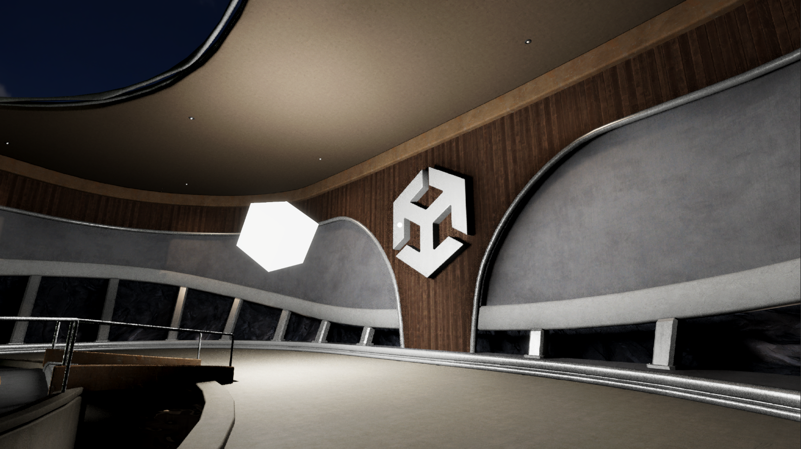
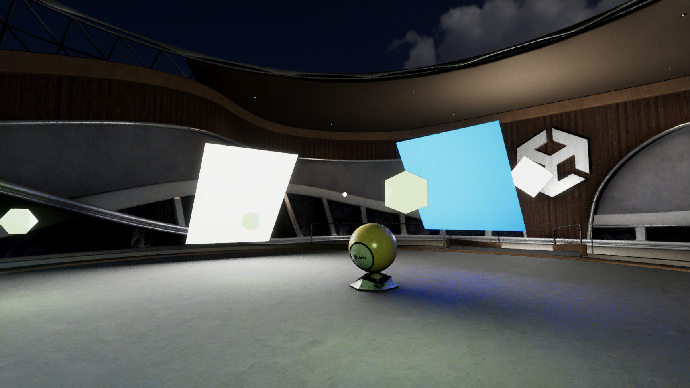

# RTXDI(ReSTIR DI) Minimal Sample with Unity 2022 in URP

## Intro.

This is a minimal sample which presents RTXDI (or ReSTIR DI) in Unity 2022.3.17f1 with URP, it`s not ready for production, just a demostration for learning

This sample is tested on 13700F+RTX4070 PC, if you get any other questions on your Graphics Card, please post an issue

## Limitations

- You must enable DX12 for Ray Tracing, and your Graphics Card needs to support DXR
- Unity dont support bindless resources feature, so i have to use a whole RWStructuredBuffer to build all polymorphic light vertices in the scene, this is stressful for RAM
- Because of no bindless support, all emissive textures on polymorphic light should have same dimensions and DXT1 format, this is more like a preview function (or you can change the code for other formats...)

## How to use

1. Clone this repo

2. Open with Unity 2022.3.17f1, locate to '**TerminalScene_Night**' scene
3. There are some tips in Hierarchy-README, you can read it, depends on you :)
4. I set TAA to main camera, because i havent integrate NRD yet, so i just use TAA for supersampling and denoising, press play button and check it.

## Third Party

- [kMotion](https://github.com/Kink3d/kMotion)

## Reference

- [NVIDIA-RTXDI](https://github.com/NVIDIAGameWorks/RTXDI)